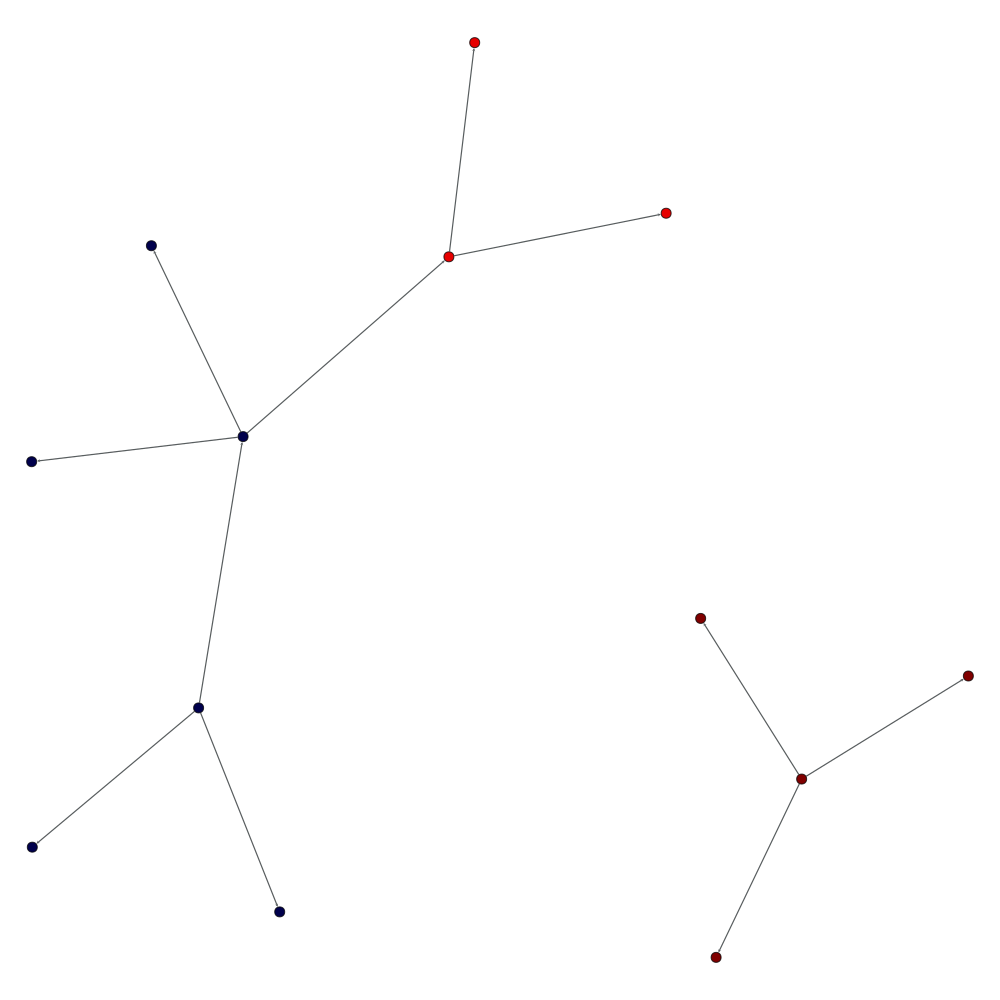

# Project: Limited Infection

Rolling out features on a live web site with active users
requires care to avoid exposing the entire user base
to bad bugs. Features are rolled out slowly, first to a small
subset of users, then to larger and larger sets of users
as bugs are ironed out and the new features are deemed desirable
and robust.

In this particular instance of the feature roll out problem,
we are asked to consider a classroom setting. Ideally,
the entire class is introduced to a feature simultaneously
to avoid confusion between members of the classroom,
students and teachers both, that might see different feature
sets otherwise.

## Running the Implementations

The code was written in Python using Python v2.7.8. The files are

* `drawgraph.py` draw a coaching graph. Requires `graph-tool` and `matplotlib`.
* `graph.py` general graph routines.
* `infect.py` infection routines and main script.
* `infect_test.py` unit tests for graph and infection routines.
* `randomgraph.py` generates random coaching graphs with a class oriented
  structure.
* `graphs/*.json` sample coaching graphs
* `figures/*.png` visualizations of the graphs

### Infecting graphs
The usage message for `infect.py` is

```
usage: infect.py [-h] [-e NUM | -l MIN MAX | -t USER]
                 feature infilename outfilename

Infect a coaching graph.

positional arguments:
  feature               infect the graph with this feature
  infilename            input file containing coaching graph
  outfilename           output file containing infected graph

optional arguments:
  -h, --help            show this help message and exit
  -e NUM, --exact-infection NUM
                        infect exactly NUM users if possible
  -l MIN MAX, --limited-infection MIN MAX
                        infect MIN to MAX users if possible
  -t USER, --total-infection USER
                        totally infect the component containing USER
```

Sample executions are:

```bash
# Total infection with pop_quiz feature starting at node A
python infect.py -t A pop_quiz graphs/graph1.json graphs/infected1.json

# Limited infection with exam feature for between 4 and 8 users
python infect.py -l 4 8 exam graphs/graph2.json graphs/infected2.json

# Exact infection with prize feature for 9 users
python infect.py -e 9 prize graphs/graph3.json graphs/infected3.json
```

### Creating Random Graphs

A small utility `randomgraph.py` was written to create random 
coaching graphs. Graphs are class oriented with a chosen probability
of including existing users in new classes. The implementation is very
rough and resulting graphs are not completely guaranteed to be within
the given parameters, but should be close.

The usage message is

```
usage: randomgraph.py [-h]
                      outfilename NUM_CLASS MIN_SIZE MAX_SIZE EXISTING_RATE

Generate a random coaching graph.

positional arguments:
  outfilename    output file containing infected graph
  NUM_CLASS      number of classes to create
  MIN_SIZE       minimum number of students in a class
  MAX_SIZE       maximum number of students in a class
  EXISTING_RATE  rate of existing users to place in a class

optional arguments:
  -h, --help     show this help message and exit
```

A sample execution to create 10 classes with between 10 and 30
students per class and a 5% chance of including existing students
is:

```bash
python randomgraph.py graphs/randomgraph.json 10 10 30 0.05
```

### Running Tests
To run the unit tests:

```bash
python infect_test.py
```

### Visualizing Graphs

See the *Optional: Graph Visualization* below for details.

## Coaching Graph Files

Coaching graphs are provided in JSON format.
Two attributes are provided: `users` which is an array of user names;
and `coaches` which is a dictionary with user names as keys and 
arrays of users they coach for values. A simple example with four
users, one of which is the coach, is shown below.

```json
{
    "users": [ "A", "B", "C", "D" ],
    "coaches": {
        "A": [ "B", "C", "D" ]
    }
}
```

Coaching graphs may contain an optional `features` attribute,
providing the features each user has in a dictionary. This is
useful for seeing what happens after infecting a graph.
For example, after a total infection of the small component, the following
is obtained for `graphs/graph3.json`.

```json
{
    "coaches": {
        "A": [ "C", "B", "D" ], 
        "J": [ "K", "L", "M" ], 
        "B": [ "E", "F", "G" ], 
        "E": [ "I", "H" ]
    }, 
    "users": [ "A", "C", "B", "E", "D", "G", "F", "I", "H", "K", "J", "M", "L" ], 
    "features": {
        "A": [], 
        "C": [], 
        "B": [], 
        "E": [], 
        "D": [], 
        "G": [], 
        "F": [], 
        "I": [], 
        "H": [], 
        "K": [ "power" ], 
        "J": [ "power" ], 
        "M": [ "power" ], 
        "L": [ "power" ]
    }
}
```

## User Model

The original problem description states:

> We can use the heuristic that each teacher­student pair should
be on the same version of the site. So if A coaches B and we want
to give A a new feature, then B should also get the new feature.
Note that infections are transitive ­ if B coaches C, then C should
get the new feature as well. Also, infections are transferred by
both the "coaches" and "is coached by" relations.

An individual user is modeled as a node in a directed graph,
with outgoing edges representing "coaches" relationships,
and incoming edges representing "is coached by" relationships.
Furthermore, users store sets of web site features
that they currently have, which defines the version of the site
they see.  In a very controlled setting, a more limited number
of feature combinations might be allowed and defined by a simple
identifier. To keep the code simple, features are implemented as
strings.

```python
class User(graph.Node):
    """Model users as graph nodes with some special methods."""

    def __init__(self, id, features=set()):
        """Initialize a user with a set of features."""
        _features = set() | features
        super(User, self).__init__(id, _features)

    def features(self):
        """Return the features this user has."""
        return self.data()

    def add_feature(self, feature):
        """Add a web site feature to this user."""
        self.data().add(feature)

    def discard_feature(self, feature):
        """Discard a feature from this user."""
        self.data().discard(feature)

    def update_feature(self, feature):
        """Adds or discards a feature. Discards if feature starts with !"""
        if feature.startswith("!"):
            self.discard_feature(feature[1:]) # remove the leading !
        else:
            self.add_feature(feature)

    def coaches(self):
        """Return the set of users this user coaches"""
        return self.outgoing()

    def is_coached_by(self):
        """Return the set of users this user is coached by"""
        return self.incoming()
```

## Total Infection

The original problem statement states:

> Starting from any given user, the entire connected component of
the coaching graph containing that user should become infected.

Since a directed graph is used to model the coaching graph,
and infection is spread by "coaches" and "is coached by" relationships,
the **weakly connected component** containing the initial user
is found. All nodes in the component are infected with the feature.
As a slight extension, if a feature starts with an exclamation point (!),
the infection discards the feature.

```python
def total_infection(coaching_graph, feature, initial_user_id):
    """Totally infect a coaching graph component with a feature"""
    infected = coaching_graph.connected_component(initial_user_id)
    for user in infected:
        user.update_feature(feature)
```

## Limited Infection

Because of the graph structure total infection provides limited
control over the proportion of the coaching graph that will be
infected.  In general, directed graphs might have several
**weakly connected components**. It is possible that a component
consists of a single, lonely student or teacher (we don't really
know which).  Alternatively, everyone could be weakly connected,
by some path of "coaches" and "is coached by" relationships, to
everyone else. This is suggested by the statement:

> Starting an infection could cause only that person to become
infected or at the opposite (unrealistic) extreme it could cause
all users to become infected.

The second part of the original problem states:

> We would like to be able to infect close to a given number of
users. Ideally we’d like a coach and all of their students to either
have a feature or not. However, that might not always be possible.

> Implement a procedure for limited infection.

A few design decisions are made:
* An acceptable range of users to infect is specified. It is assumed
  the minimum and maximum number of users is provided correctly.
* Infecting whole components first is desirable. This keeps all coaches
  and students in sync with their feature sets. This process continues
  until the acceptable range is achieved or it is not possible to
  add a component and remain within the range.
* If infecting whole components does not get within
  the desired range of infected users, 
  then class infections will take place.
  Class infections start with coaches and ignore transitivity 
  and "is coached by" relationships until
  getting within the range is achieved 
  or it is determined to not be possible.
  Class infections aim to keep individual classes in sync.
  It is assumed that a user with two coaches is in two different
  classes, and that a user that is both a coach and being coached
  has those relationships in two different classes.
  Users may be more accepting of different features in different classes.
* If it is not possible to infect an acceptable range of users,
  by first infecting whole components then employing class infection,
  the function will not perform the infection and fail.
  This may fail, even though partial infection on its own could succeed.

```python
def limited_infection(coaching_graph, feature, min_users, max_users):
    """Perform a limited infection, between minimum and maximum users.

    Limited infections first infect entire components then infect
    classes, starting with coaches and their students (ignoring
    transitivity and "is coached by" relationships). If a limited infection
    exists between the minimum and maximum number of users (inclusive), 
    it will be performed.
    
    Returns True if the infection was successful, False otherwise.
    """

    users = approx_component_infection(coaching_graph, min_users, max_users)
    if len(users) < min_users:
        # Component infection didn't infect enough users. Move to class
        # infections.
        seeds = coaching_graph.all_parents() | coaching_graph.all_singletons()
        seeds -= users # Remove already infected users.
        min_class_users = min_users - len(users)
        max_class_users = max_users - len(users)
        class_users = approx_class_infection(coaching_graph, seeds, 
                min_class_users, max_class_users)
        users |= class_users

    if len(users) >= min_users:
        for user in users:
            user.update_feature(feature)
        return True

    return False
```

### Other Limited Infection Approaches

We could employ the rules of class infection all the time,
and try prioritizing classes through transitivity and "is coached by"
relationships, to try to fill in whole components first.

## Optional: Exact Limited Infection

One of the optional assignments is to

> write a version of `limited_infection` that infects *exactly* the number
of users specified and fails if that's not possible (this can be (really)
slow)

If it is assumed that this means only whole components are infected,
this assignment is essentially a form of the 
(subset sum problem)[http://en.wikipedia.org/wiki/Subset_sum_problem],
where the multiset of integers consists
of the sizes of the connected components
and -1 times the number of users specified. For example,
if the component sizes are 1, 2, and 3 and the number of desired users
to infect is 4, the subset sum problem would be to find a
non-empty subset of {1, 2, 3, -4} that totals to 0.
This is known to be NP-complete,
meaning no polynomial time algorithm
for all inputs is known to exist.

It is possible to solve though, 
with one naive approach being
to enumerate all possible subsets
of the connected components and stopping
when the sum of their sizes equals
the desired number of infected users.
This naive approach is implemented using recursion
in the code below.
The recursive implementation should use less memory
than trying the approximate subset sum
with the same minimum and maximum number of users,
since only a single combination of components is
in memory at a given time.

```python
def exact_subset_sum(sizes, target, i, n, subtotal):
    """Solve the subset sum problem recursively."""
    if subtotal == target:
        return [i]
    elif subtotal > target:
        # Optimization. Stop considering this possible solution.
        return False

    j = i + 1
    while j < n:
        ret = exact_subset_sum(sizes, target, j, n, subtotal + sizes[j])
        if ret != False:
            if i > -1:
                ret.append(i)
            return ret
        j = j + 1

    return False

def exact_limited_infection(coaching_graph, feature, num_users):
    """Infect a specified number of users exactly in a coaching graph."""
    components = coaching_graph.all_connected_components()
    sizes = [len(x) for x in components]
    solution = exact_subset_sum(sizes, num_users, -1, len(sizes), 0)
    if solution != False:
        for i in solution:
            for user in components[i]:
                user.update_feature(feature)
        return True
    else:
        return False
```

## Optional: Graph Visualization

This second optional implementation was written beyond the 12 hour
time limit and shouldn't be considered other than just as my personal
interest in visualizing the results. The graph visualization uses
the (graph-tool)[http://graph-tool.skewed.de/] package for Python
as well as `matplotlib` for plotting.

To make the best use of this, features are assumed to be encoded
as powers of 2 greater than 0 when infecting coaching graphs.
This way, when added together, they form a bit vector encoding
the combination of features each user has.

```
```

The following example below performs two total infections and
a limited infection on the small two component example graph
in the repository. This illustrates how to visualize mixtures
of features.

```bash
python infect.py -t A 1 graphs/graph3.json graphs/infected3.json
python infect.py -t J 2 graphs/infected3.json graphs/infected3.json
python infect.py -l 5 8 4 graphs/infected3.json graphs/infected3.json
python drawgraph.py graphs/infected3.json figures/infected3.png
```

The output from these commands is shown in the following figure.



### Visualization Note

Unfortunately, the current tool does not maintain graph locations
across graphs. This makes it difficult to incrementally see the impact
of infecting the graph with multiple steps. This feature is 
something to add in the future.

## Possible Improvements
Some improvements to the project submission provided include:

* More output to indicate progress.
* A more exhaustive set of unit tests, particularly for the graph routines.
* Additional error handling and recovery. Currently there are no checks
  for badly formed graphs, minimum and maximum users in the right order,
  and other "sad path" types of behavior.
* More optimization for the approximate and exact subset sum implementations.
  For the exact subset sum, heuristics might be useful for picking more
  favorable components to add in next, for example. This still doesn't
  improve worst case performance, but could impact average case.
* Better memory usage throughout.
* General code cleanup to be more readable and consistent in thought.
* Return more than one approximate or exact infection if they exist. This
  has added overhead though, and is not likely to be useful in large scale
  settings.
* Use a more standard graph package. The choice was made not to do so
  to keep the solution self sufficient, illustrate problem solving skills
  and expediency.
* Use more standard graph file representation. The choice of JSON was
  again for expediency and simple access to Python's `json` package.

## Time Taken

About 12 hours was taken 
to implement the infection routines,
basic graph implementation,
random graph generation,
unit tests and examples,
and write the documentation.

An additional hour 
was used to implement the visualization,
above and beyond the requirements.
This was done primarily out
of personal interest 
to see the graphs and effects
of infections at larger scale.
